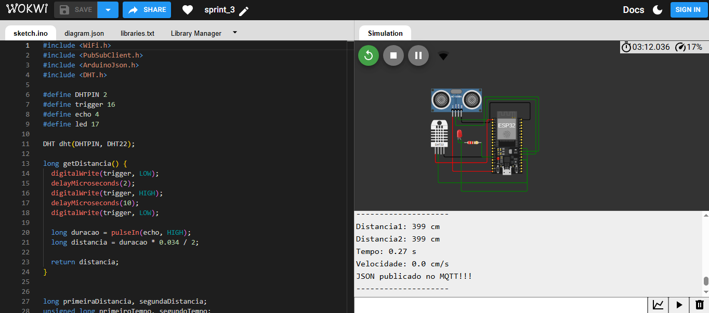
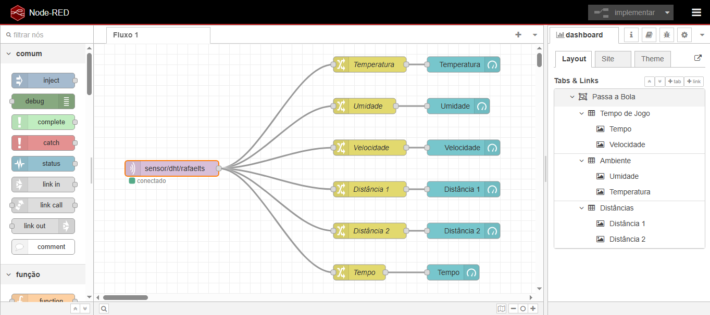
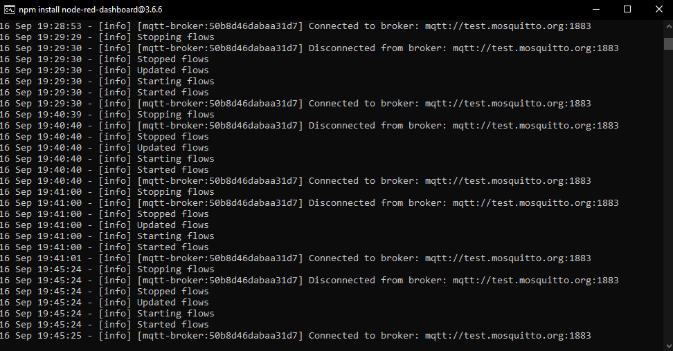
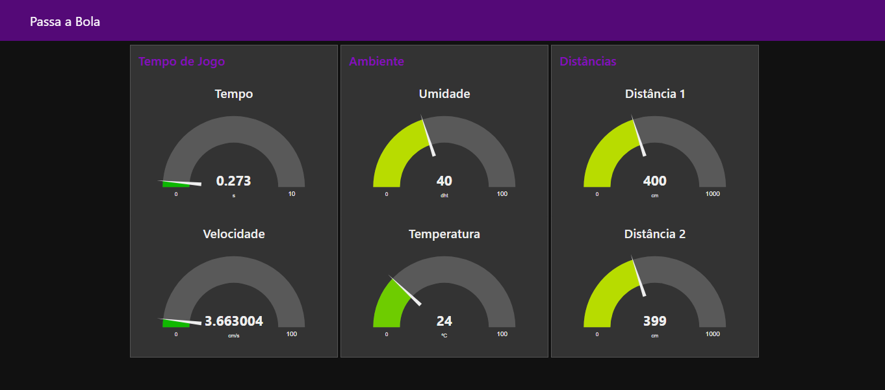

# Edge Computing and Computer Systems - Sprint 3 (Passa a Bola)

## 🧠 1. Descrição

O projeto **Passa a Bola** tem como objetivo aplicar conceitos de **IoT (Internet of Things)** no contexto do futebol feminino, monitorando em tempo real variáveis ambientais (temperatura e umidade) e métricas de desempenho em campo (distâncias e velocidade).

Combinando **ESP32**, sensores **DHT22** e **HC-SR04**, e integração via **MQTT** com **Node-RED**, o sistema é capaz de:

* Coletar dados de atletas e ambiente.
* Processar e transmitir informações em formato JSON.
* Visualizar indicadores em dashboards interativos.
* Simular condições reais de jogo para apoiar análises de desempenho.

📌 Protótipo desenvolvido na plataforma **Wokwi**:
👉 [Acesse aqui o projeto](https://wokwi.com/projects/442284840585644033)
👉 [Acesse aqui o vídeo explicativo](https://youtu.be/wx_2yOgwy-k)

---

## 🏗️ 2. Arquitetura da Solução

O sistema segue uma arquitetura IoT básica:

1. **Camada de Sensoriamento**:

   * DHT22 → mede temperatura e umidade.
   * HC-SR04 → calcula distâncias.
   * LED → atuador para indicar status do sistema.

2. **Camada de Processamento (Edge)**:

   * ESP32 realiza cálculo de velocidade com base na variação de distância em tempo e publica mensagens no broker MQTT.

3. **Camada de Comunicação**:

   * Protocolo **MQTT** com broker público **test.mosquitto.org**.

4. **Camada de Visualização**:

   * **Node-RED** organiza e exibe dados em dashboard interativo.

---

## 🔌 3. Diagrama

### Esquemático no Wokwi



### Fluxo no Node-RED



### Logs de Conexão MQTT



### Dashboard Final



---

## ✅ 4. Funcionalidades

* **Monitoramento ambiental**

  * Temperatura (°C)
  * Umidade (%)
  * Alertas para valores inadequados (t > 40 °C, h < 20%)

* **Monitoramento de desempenho**

  * Distância inicial (cm)
  * Distância final (cm)
  * Tempo entre leituras (s)
  * Velocidade calculada (cm/s)

* **Comunicação IoT**

  * Dados publicados no tópico `sensor/dht/rafaelts` em formato JSON.
  * Controle remoto do LED pelo tópico `led/control/rafaelts`.

* **Dashboard Node-RED**

  * Gráficos e indicadores agrupados em abas:

    * ⏱️ **Tempo de Jogo** → Tempo e Velocidade
    * 🌡️ **Ambiente** → Temperatura e Umidade
    * 📏 **Distâncias** → Distância 1 e Distância 2

---

## 🛠️ 5. Recursos Necessários

* **Hardware**:

  * ESP32 DevKit v4
  * Sensor DHT22 (temperatura/umidade)
  * Sensor Ultrassônico HC-SR04
  * LED + Resistor 220Ω

* **Software/Plataformas**:

  * Arduino IDE / Wokwi (simulação)
  * Node-RED + node-red-dashboard
  * Broker MQTT público (test.mosquitto.org)

---

## 📂 6. Estrutura do Projeto

```bash
├── sketch.ino                  # Código principal do ESP32
├── diagram.json                # Esquemático do circuito no Wokwi
├── assets                      # Estrutura padrão
│   └── src                     # Arquivo source 
│       └── images              # Capturas de tela do projeto
│           ├── imagem_1.png    # Diagrama no Wokwi
│           ├── imagem_2.png    # Fluxo Node-RED
│           ├── imagem_3.png    # Logs de conexão MQTT
│           └── imagem_4.png    # Dashboard final
└── README.md                   # Documentação do projeto
```

---

## ▶️ 8. Como Executar

1. Clone o repositório e abra o código no [Wokwi](https://wokwi.com).
2. Configure o **Node-RED** com `node-red-dashboard` e conecte ao broker `test.mosquitto.org`.
3. Importe o fluxo JSON para visualizar os dados.
4. Execute a simulação no Wokwi e veja as métricas no painel interativo.

---

## 👥 Integrantes

- Caio Nascimento Caminha
- Gabriel Alexandre Fukushima Sakura
- Gabriel Oliveira Amaral
- Lucas Henrique Viana Estevam Sena
- Rafael Tavares Santos

---

## 📜 Licença

Projeto acadêmico. Uso livre para fins educacionais.